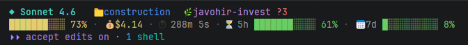

# Claude Code Status Line

[🇬🇧 English](README.md) | 🇺🇿 O'zbekcha

[Claude Code](https://claude.ai/code) uchun chiroyli, ko'p platformali status qatori — model nomi, kontekst foizi, sessiya narxi, git holati va rate limitlarni to'g'ridan-to'g'ri terminalda ko'rsatadi.

```
◆ Sonnet   📁 loyiham   🌿 main +2 ~1
███████░░░ 68%  ·  💰 $1.87  ·  ⏱ 4m 12s  ·  ⏳ 5h ██████░░░░ 55%  ·  📅 7d ████████░░ 82%
```



---

## Imkoniyatlar

- **Model nomi** — qaysi Claude modeli faolligini ko'rsatadi
- **Kontekst paneli** — rang bilan ko'rsatiladi: yashil < 70%, sariq 70–89%, qizil ≥ 90%
- **Sessiya narxi** — joriy sessiyada sarflangan taxminiy USD
- **Sessiya vaqti** — sessiya boshlanganidan o'tgan vaqt
- **Git branch + o'zgarishlar** — sahnalashtirilgan, o'zgartirilgan va kuzatilmagan fayllar
- **Rate limit foydalanishi** — 5 soatlik va 7 kunlik limitlar (faqat Pro/Max foydalanuvchilari)
- **NPM bog'liqliksiz** — faqat Node.js o'rnatilgan modullari ishlatiladi
- **macOS, Linux va Windowsda ishlaydi**

---

## Talablar

- [Node.js](https://nodejs.org) 18 yoki undan yuqori versiya
- [Claude Code](https://claude.ai/code)

---

## O'rnatish

### Bitta buyruq bilan (tavsiya etiladi)

```
npx -y github:JavoxirJava/claude-code-statusline
```

### Clone qilib o'rnatish

```bash
git clone https://github.com/JavoxirJava/claude-code-statusline
cd claude-code-statusline
node install.mjs
```

### OS bo'yicha skriptlar

**macOS / Linux:**
```bash
bash install.sh
```

**Windows (PowerShell):**
```powershell
.\install.ps1
```

> **Windows eslatmasi:** agar PowerShell skriptni bloklasa, bir marta quyidagi buyruqni bajaring:
> ```powershell
> Set-ExecutionPolicy -ExecutionPolicy RemoteSigned -Scope CurrentUser
> ```

O'rnatgandan so'ng **Claude Code'ni qayta ishga tushiring yoki biror xabar yuboring** — status qatori ko'rinadi.

### Loyiha bo'yicha o'rnatish

Global `~/.claude/settings.json` o'rniga `./.claude/settings.json` ga o'rnatish uchun `--project` ni qo'shing:

```bash
node install.mjs --project
```

---

## Har bir qismning ma'nosi

| Segment | Ma'nosi |
|---|---|
| `◆ Opus` | Faol Claude modeli |
| `📁 loyiham` | Joriy katalog nomi |
| `🌿 main +2 ~1` | Git branch; `+` sahnalashtirilgan, `~` o'zgartirilgan, `?` kuzatilmagan |
| `███████░░░ 68%` | Kontekst oynasi foydlanishi (yashil/sariq/qizil) |
| `💰 $0.42` | Taxminiy sessiya narxi |
| `⏱ 4m 12s` | Sessiya boshlanganidan o'tgan vaqt |
| `⏳ 5h ██████░░░░ 55%` | 5 soatlik rate limit foydalanishi (faqat Pro/Max) |
| `📅 7d ████████░░ 82%` | 7 kunlik rate limit foydalanishi (faqat Pro/Max) |

Rang bo'saglalari kontekst paneli va rate limit foizlariga qo'llaniladi:
- **Yashil** — 70% dan past
- **Sariq** — 70–89%
- **Qizil** — 90% va undan yuqori

---

## Sozlash

Barcha muhit o'zgaruvchilari ixtiyoriy. Ularni `settings.json` dagi `command` ichida yoki shell profilingizda eksport qiling.

| O'zgaruvchi | Qiymatlar | Ta'siri |
|---|---|---|
| `NO_COLOR` | istalgan | Barcha ANSI ranglarni o'chiradi |
| `CCSL_NO_EMOJI` | `1` | Emojini oddiy matn bilan almashtiradi |
| `CCSL_NERD_FONTS` | `1` | Nerd Font / Powerline belgilarini ishlatadi |
| `CCSL_HIDE` | `cost,duration,git,ratelimit` | Muayyan segmentlarni yashiradi (vergul bilan ajratilgan) |
| `CCSL_BAR_WIDTH` | `4`–`40` | Kontekst paneli kengligi (standart `10`) |
| `CCSL_LINES` | `1` yoki `2` | Bir yoki ikki qatorni majburlaydi |

**Misol** — rate limitlarni yashirish va Nerd Fontslardan foydalanish, to'g'ridan-to'g'ri `settings.json` da:

```json
{
  "statusLine": {
    "type": "command",
    "command": "CCSL_HIDE=ratelimit CCSL_NERD_FONTS=1 node \"/home/siz/.claude/statusline.js\"",
    "padding": 0
  }
}
```

---

## Claude Code'siz ko'rish

```bash
node test.mjs
# yoki
npm run preview
```

---

## Yangilash

O'rnatish buyrug'ini qayta ishga tushiring. O'rnatuvchi `statusline.js` ning so'nggi versiyasini `~/.claude/` ga ko'chiradi va `settings.json` ni yangilaydi.

---

## O'chirish

```bash
node uninstall.mjs
```

Bu `settings.json` dan `statusLine` kalitini olib tashlaydi. Skript fayli o'z joyida qoladi — to'liq tozalash uchun `~/.claude/statusline.js` ni qo'lda o'chiring.

---

## Muammolarni hal qilish

**Status qatori ko'rinmayapti**
- Claude Code'dagi workspace trust so'rovini qabul qiling va qayta ishga tushiring.
- Node.js `PATH` da borligiga ishonch hosil qiling (`node --version` versiyani chiqarishi kerak).

**Node topilmadi**
- [nodejs.org](https://nodejs.org) dan o'rnating.

**Windowsda yo'l noto'g'ri**
- O'rnatuvchi avtomatik ravishda oldinga chiziqlardan foydalanadi. Agar `settings.json` ni qo'lda tahrirlagan bo'lsangiz, yo'l `\` emas `/` ishlatishiga ishonch hosil qiling.

**Qiymatlar `--` ko'rsatilmoqda yoki yo'q**
- Ba'zi maydonlar (masalan, rate limitlar) faqat sessiyadagi birinchi API javobidan keyin paydo bo'ladi.
- Status qatori skriptidagi xatolarni ko'rish uchun `claude --debug` ni ishga tushiring.

---

## Qanday ishlaydi

Claude Code har bir yangilanishda (taxminan 300 ms debounce bilan) stdin orqali JSON obyektini sozlangan buyruqqa uzatadi. Skript barcha stdin ni o'qiydi, JSON ni tahlil qiladi va stdout ga bir yoki ikki ANSI-rangli qator yozadi. Stdoutning birinchi qatori status qatoriga aylanadi. Git chaqiruvlari tezlikni saqlash uchun vaqtinchalik faylda 5 soniya davomida keshlanadi.

---

## Mualliflar

- [Claude Code status line hujjatlari](https://code.claude.ai/docs/en/statusline)
- MIT Litsenziya — © 2026 Javohir
